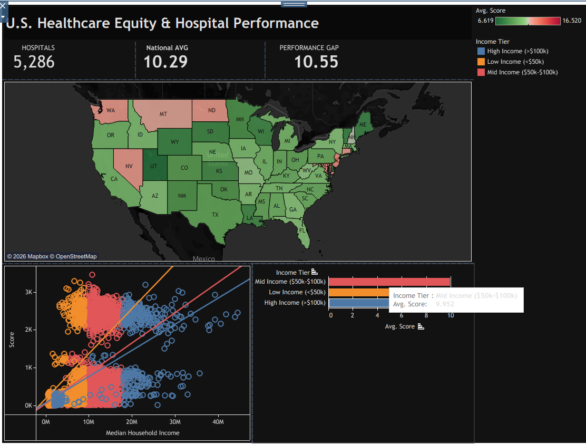
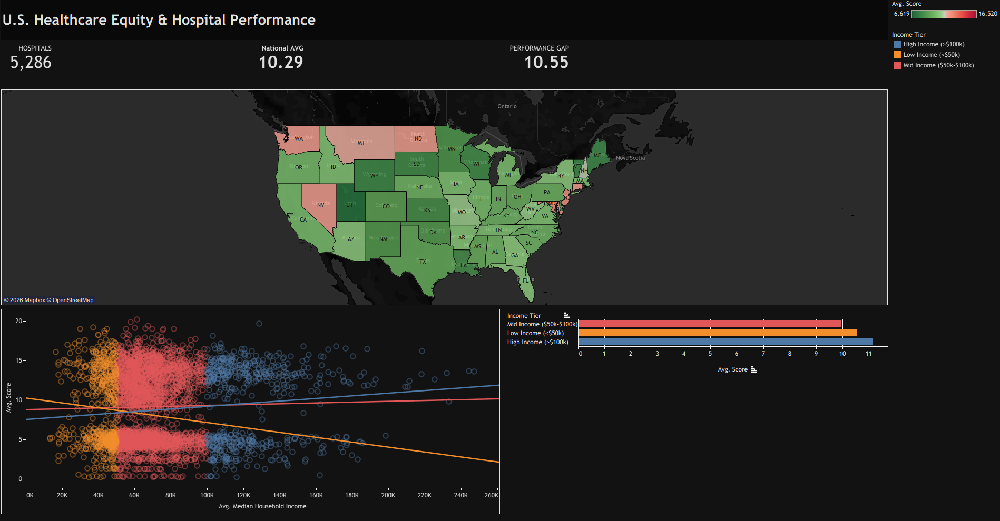
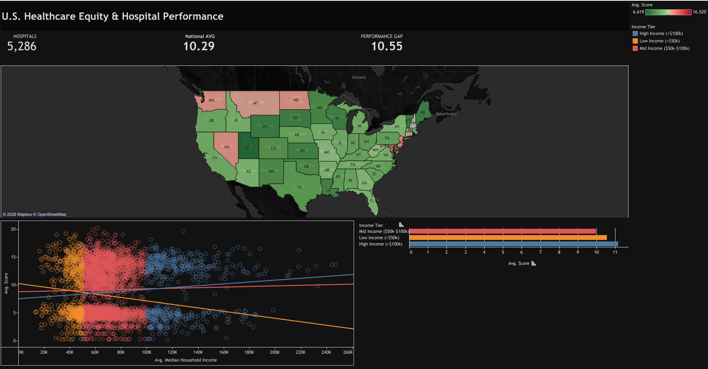

🏥 U.S. Healthcare Equity & Clinical Performance Analysis
Strategic Data Science Analysis to Measure Clinical Disparities

📌 Executive Summary
This project investigates the critical relationship between community socioeconomic status and healthcare quality across 5,000+ U.S. hospitals. By correlating Median Household Income with Clinical Risk Scores, I identified a significant "Equity Gap" where lower-income communities face higher mortality and safety risks. The dashboard serves as a command center for policymakers to identify and target underperforming regional hotspots.

🖼️ Dashboard Showcase

 

<i>A high-contrast, dark-mode command center designed for executive-level healthcare policy analysis.</i> 

🛠️ The Data Journey (Process)
1. Data Gathering
Sources: Integrated CMS Hospital General Information datasets with U.S. Census-based median household income data (mapped via ZIP codes).

Volume: Handled records for 5,000+ facilities spanning all 50 U.S. states to ensure national representation.

2. AI-Powered Cleaning & ETL
AI Assistance: Used AI-driven Python scripts to perform complex joins between healthcare metrics and demographic datasets, handling 15% missing values in clinical scoring.

Data Transformation: * Performed Normalization to standardize clinical scores across diverse hospital types.

Created Income Tiers (High, Mid, Low) to enable categorical benchmarking.

Validated geographic data to ensure 100% accuracy in geospatial mapping.

3. Data Modelling
Architecture: Developed a unified master data structure optimized for high-performance filtering in Tableau.

Calculated Fields: Implemented LOD (Level of Detail) Expressions to maintain a stable National Average Score benchmark across all dashboard states.

Statistical Analysis: Applied Linear Regression trend lines within the scatter plot to visualize the mathematical strength of the wealth-health correlation.

💡 Key Clinical Insights
The Equity Gap: The data mathematically confirms a negative correlation: as community income increases, clinical risk scores significantly decrease.

National Performance Gap: There is a distinct 10.55% disparity in clinical safety scores between the highest and lowest income tiers.

Regional Outliers: Identified specific states where even mid-income hospitals fall below the national average, suggesting regional systemic issues.

🚀 Tools Used
Tableau: Advanced Visualization, Geospatial Mapping, and Dashboard Actions.

Python/AI: Data Cleaning, ETL, and Automated Scripting.

Statistics: Correlation Analysis and Linear Regression Modeling.

UI/UX Design: Professional "7 Vogue" Dark Theme for high-impact storytelling.

📬 Contact & Portfolio
Manas Hitendra Bramhankar 3rd Year B.Tech, AI & Data Science [www.linkedin.com/in/manas-bramhankar-73831628b] | [manasbramhankar@gmail.com]
